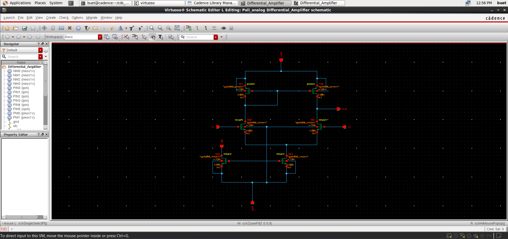
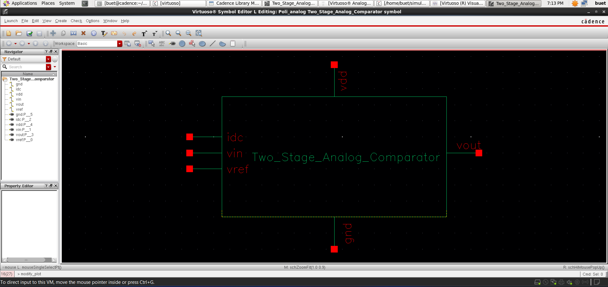
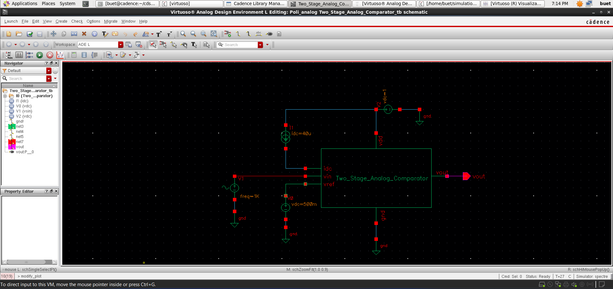
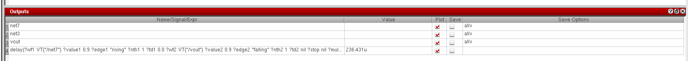
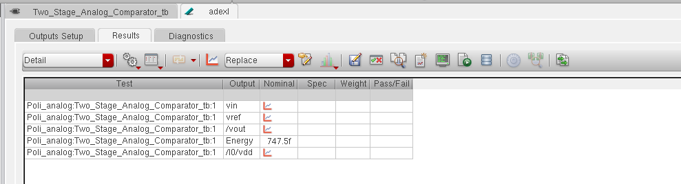

# 📘 Two-Stage CMOS Analog Comparator Design (GPDK 90nm)

<p align="center">
  <b>Analog IC Design | High-Gain Comparator | Signal Conversion</b><br>
  Cadence Virtuoso • Spectre • Assura • GPDK 90nm
</p>

<p align="center">
  
  
  
  
</p>

---

## 🚀 Overview
This project presents the **design and simulation of a Two-Stage CMOS Analog Comparator** using **GPDK 90nm technology** in Cadence Virtuoso.

The comparator converts an **analog input signal (Vin)** into a **digital output** by comparing it with a reference voltage (Vref).

---

## 📂 Project Structure
```
AnalogComparator_TwoStage/
│── README.md        # Project overview and documentation
│── images/          # Simulation results and layout screenshots
│── files/           # Cadence design files (schematic, layout, testbench)
```

---

## 🛠️ Tools & Technology
- **Cadence Virtuoso**
- **Spectre Simulator**
- **Assura (DRC, LVS, RCX)**
- **PDK:** GPDK 90nm

---

## 📐 Schematic Design

<p align="center">
  
</p>

### Architecture:
- **Stage 1:** Differential Amplifier  
- **Stage 2:** Gain/Output Stage  

### Key Features:
- High gain amplification  
- Improved sensitivity  
- Proper signal conversion from analog → digital  

---

## 🔷 Symbol View

<p align="center">
  
</p>

- Inputs:
  - `vin` → Input signal  
  - `vref` → Reference voltage  
  - `idc` → Bias current  
- Output:
  - `vout`  

---

## 🧪 Testbench Setup

<p align="center">
  
</p>

- **Vin:** Sinusoidal input signal  
- **Vref:** Constant DC reference (~0.5V)  
- **Bias Current:** 40µA  
- Output observed across load  

---

## ⚡ Transient Analysis

<p align="center">
  
</p>

### Observations:
- Comparator output switches when:
  - \( V_{in} > V_{ref} \) → Output HIGH  
  - \( V_{in} < V_{ref} \) → Output LOW  
- Clean digital output generated from analog input  
- Proper switching behavior observed  

---

## ⏱️ Delay Analysis

<p align="center">
  
</p>

- Propagation delay measured  
- **Delay ≈ 236.43 µs**

---

## ⚡ Energy Analysis

<p align="center">
  
</p>

- Energy consumption during operation  
- **Energy ≈ 747.5 fJ**

---

## 🧩 Design Insights

- Differential pair ensures:
  - High sensitivity  
  - Noise rejection  
- Current mirror provides:
  - Stable biasing  
- Second stage improves:
  - Gain  
  - Output swing  

---

## 🧩 Layout Design *(In Progress 🚧)*

- Layout will include:
  - Matching (critical for differential pair)  
  - Symmetry  
  - Common-centroid techniques  
- Parasitics will be minimized  

---

## ✅ Verification (Assura)

### ✔ DRC
- Layout rule compliance *(upcoming)*  

### ✔ LVS
- Schematic vs Layout matching *(upcoming)*  

### ✔ RCX
- Parasitic extraction *(upcoming)*  

---

## 📈 Post-Layout Analysis *(Upcoming 🚧)*

- Delay comparison  
- Gain degradation analysis  
- Power variation study  

---

## 📌 Key Learnings

- Differential amplifier design  
- Analog-to-digital signal conversion  
- Trade-offs:
  - Gain vs Speed  
  - Power vs Accuracy  
- Importance of biasing in analog circuits  

---

## 🎯 Conclusion

The Two-Stage CMOS Comparator successfully converts analog input into a digital output with clear switching behavior.

This design demonstrates:
- Strong analog fundamentals  
- Practical IC design skills  
- Readiness for advanced analog design roles  

---

## 👨‍💻 Author

**Poli Prudvi Reddy**  
📧 Email: prudvireddypoli@gmail.com  
🔗 LinkedIn: https://www.linkedin.com/in/prudvi-poli  

---

## ⭐ Support
If you found this project useful, give it a ⭐ on GitHub!
