# 📘 CMOS AND Gate Design and Analysis (GPDK 90nm)

<p align="center">
  <b>Custom IC Design | Analog Layout | Physical Verification (Ongoing)</b><br>
  Cadence Virtuoso • Spectre • Assura • GPDK 90nm
</p>

<p align="center">
  
  
  
  
</p>

---

## 🚀 Overview
This project focuses on the **design and simulation of a CMOS AND gate** using **GPDK 90nm technology** in Cadence Virtuoso.

The work demonstrates **transistor-level logic implementation**, along with detailed analysis of **switching behavior, delay, and energy consumption**.  
Layout design and physical verification are currently **in progress**.

---

## 📂 Project Structure

```
And_Gate/
│── README.md        # Project overview and documentation
│── images/          # Simulation results and layout screenshots
│── files/           # Cadence design files (schematic, layout, testbench)
```

---

---

## 🛠️ Tools & Technology
- **Cadence Virtuoso** (Schematic, ADE)
- **Spectre Simulator**
- **Assura** *(DRC, LVS, RCX – ongoing)*
- **PDK:** GPDK 90nm

---

## 📐 Schematic Design

<p align="center">
  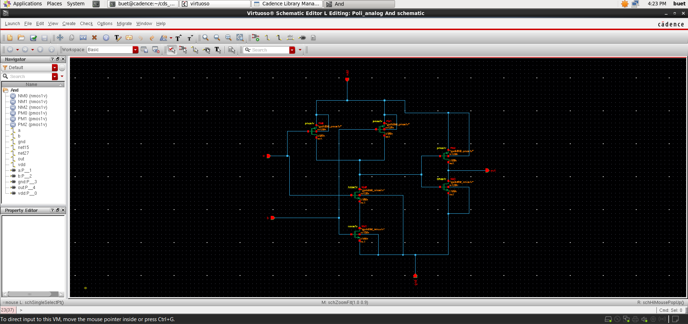
</p>

- CMOS implementation using **PMOS pull-up** and **NMOS pull-down networks**
- Logic realized using **series and parallel transistor configurations**
- Inputs: **A, B** → Output: **OUT**

---

## 🔷 Symbol View

<p align="center">
  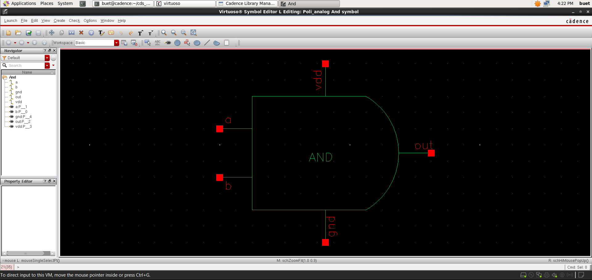
</p>

- Custom symbol created for hierarchical usage and modular design

---

## 🧪 Testbench Setup

<p align="center">
  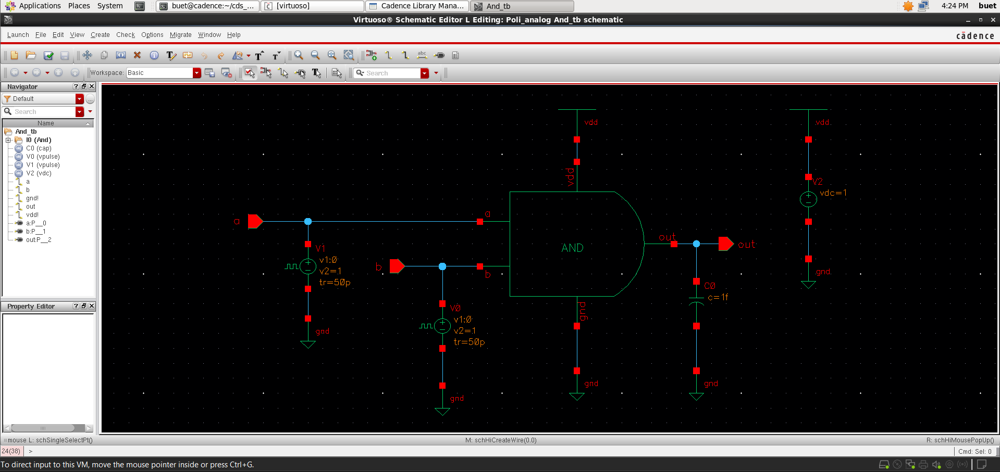
</p>

- Pulse inputs applied to verify all logic conditions:
  - 00 → 0  
  - 01 → 0  
  - 10 → 0  
  - 11 → 1  

---

## ⚡ Transient Analysis

<p align="center">
  
</p>

### Observations:
- Correct AND functionality verified  
- Output transitions only when both inputs are HIGH  
- Clean switching behavior observed  

---

## ⏱️ Delay Analysis

<p align="center">
  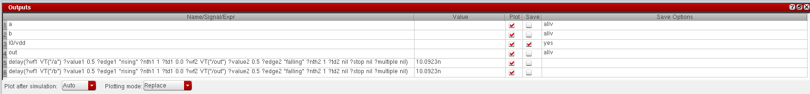
</p>

- Propagation delay measured at 50% threshold  
- **Delay ≈ 10.09 ns**

---

## ⚡ Energy Analysis

<p align="center">
  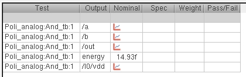
</p>

- Estimated switching energy: **~14.93 fJ**  
- Captures dynamic power behavior during transitions  

---

## 🧩 Layout Design

<p align="center">
  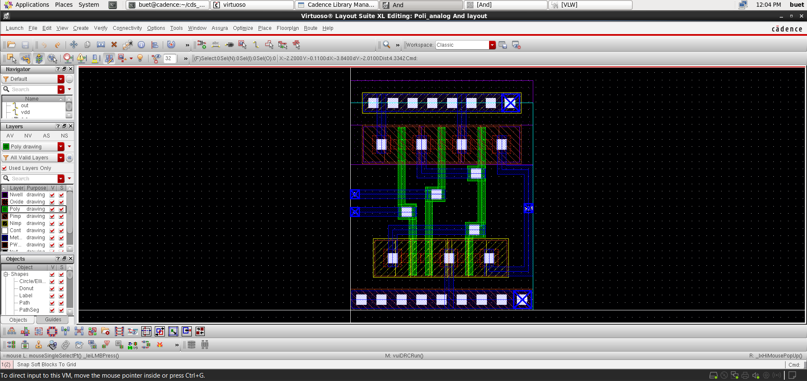
</p>

### Features:
- PMOS placed in **N-well**, NMOS in **P-substrate**
- Parallel PMOS and series NMOS implementation  
- Shared poly gates for inputs  
- Compact routing with proper use of contacts and vias  

---

## ✅ Verification (Assura)

<p align="center">
  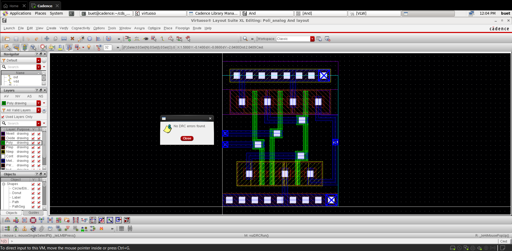
  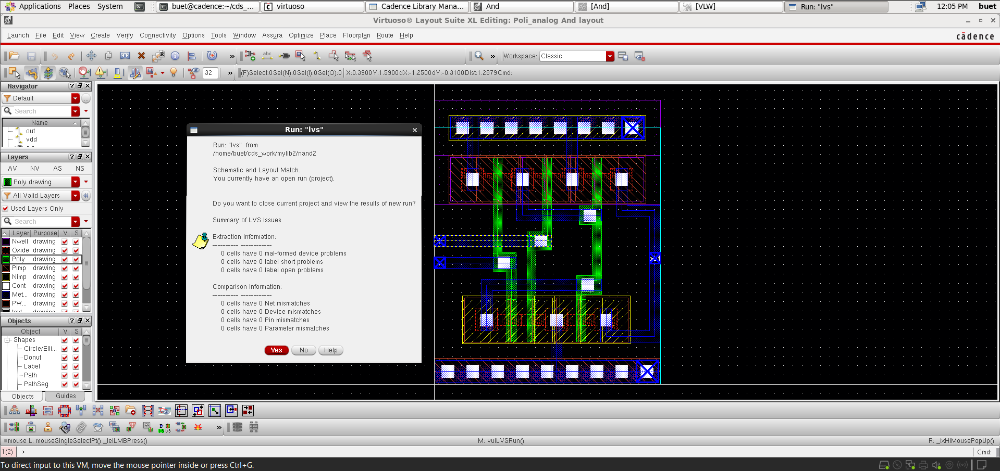
  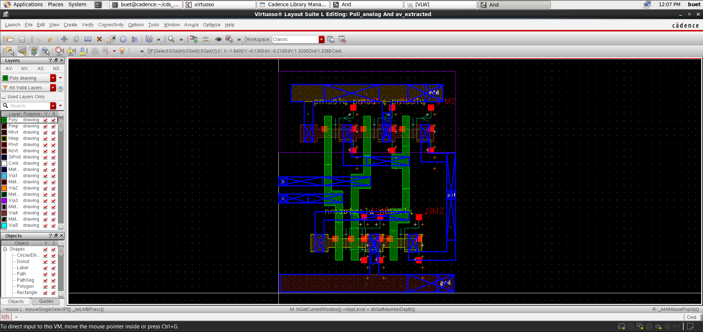
</p>

### ✔ DRC (Design Rule Check)
- No violations found  
- Layout follows all GPDK 90nm rules  

### ✔ LVS (Layout vs Schematic)
- Perfect match between schematic and layout  
- No mismatches  

### ✔ RC Extraction (RCX)
- Parasitics extracted successfully  
- Extracted view generated  

---

## 📈 Post-Layout Simulation

<p align="center">
  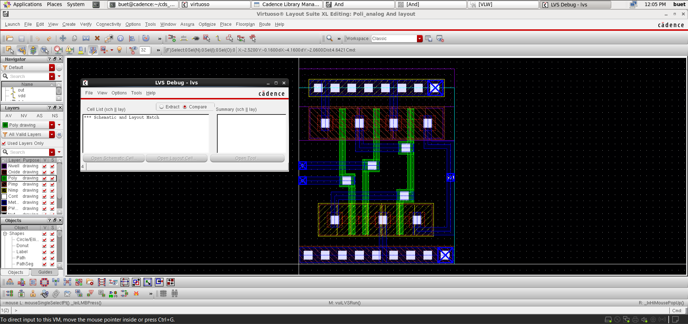
  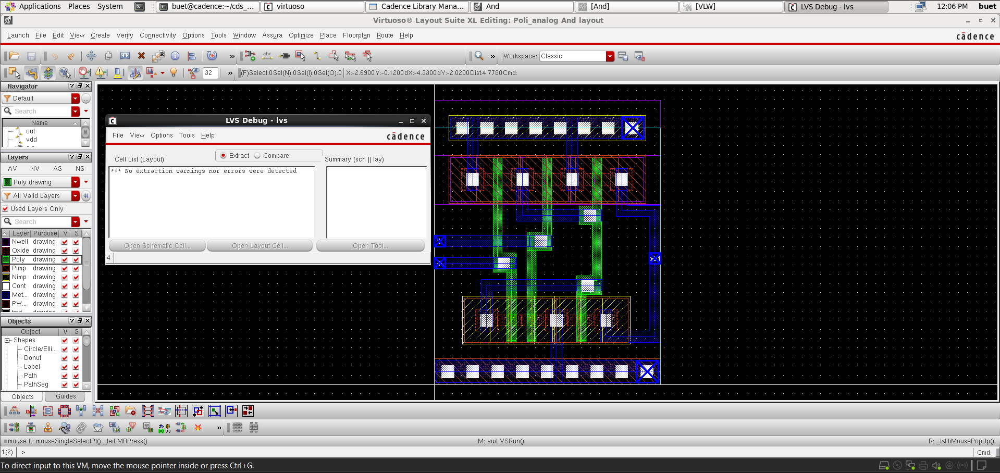
</p>

- Extracted view generated after RCX  
- Ready for post-layout simulation  

---

## 📌 Key Learnings
- CMOS logic implementation using transistor-level design  
- Series/parallel network realization of digital logic  
- Delay and energy estimation using Cadence ADE  
- Understanding switching behavior in deep submicron technology  

---

## 🎯 Conclusion
The CMOS AND gate has been successfully designed and functionally verified through simulation.  
The project is being extended to include **layout design and physical verification**, completing the full custom IC design flow.

---

## 👨‍💻 Author

**Poli Prudvi Reddy**  
📧 Email: prudvireddypoli@gmail.com  
🔗 LinkedIn: https://www.linkedin.com/in/prudvi-poli  

---

## ⭐ Support
If you found this project useful, give it a ⭐ on GitHub and feel free to connect!
