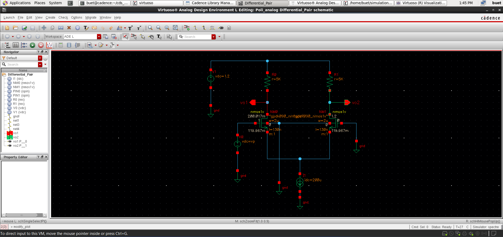
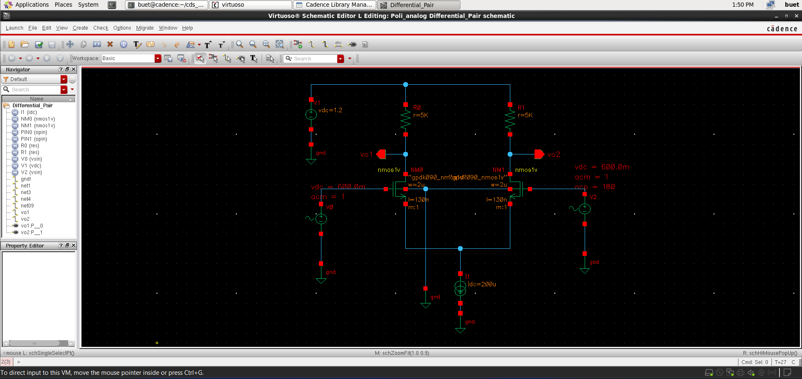
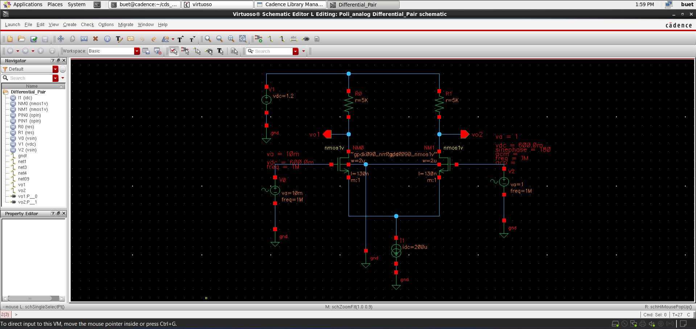
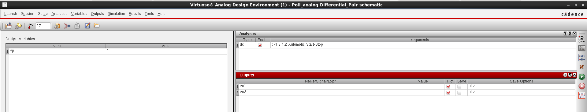
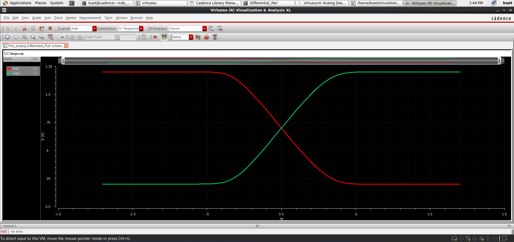
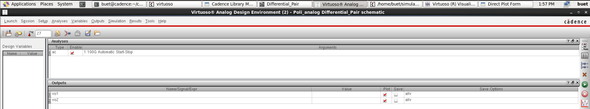
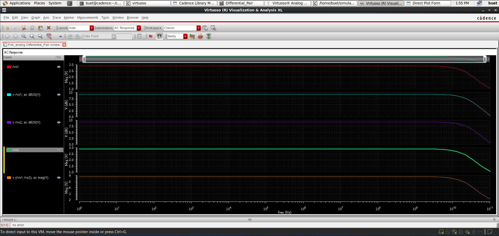
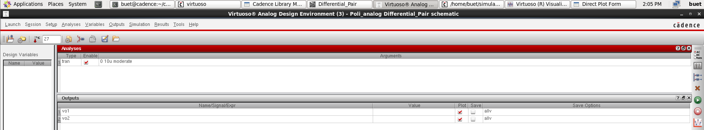

# 📘 CMOS Differential Pair Design & Analysis (GPDK 90nm)

<p align="center">
  <b>Analog IC Design | Differential Amplifier | Small-Signal Analysis</b><br>
  Cadence Virtuoso • Spectre • GPDK 90nm
</p>

<p align="center">
  
  
  
</p>

---

## 🚀 Overview

This project presents the **design and analysis of a CMOS Differential Pair**, a fundamental building block in analog IC design.

The circuit amplifies the **difference between two input signals** while suppressing common-mode components.

---

## 📂 Project Structure

```
Differential_Pair/
│── README.md
│── images/
│ ├── Differential_Pair_Schematic.png
│ ├── Differential_Pair_DC_Setup.png
│ ├── Differential_Pair_DC_Result.png
│ ├── Differential_Pair_AC_Setup.png
│ ├── Differential_Pair_AC_Result.png
│ ├── Differential_Pair_Transient_Setup.png
│ ├── Differential_Pair_Transient_Result.png
│── files/
```


---


---

## 🛠️ Tools & Technology

- **Cadence Virtuoso**
- **Spectre Simulator**
- **PDK:** GPDK 90nm

---

# 📐 Schematic Design

### 🔹 DC Configuration

<p align="center">
  
</p>

### 🔹 AC Configuration

<p align="center">
  
</p>

### 🔹 Transient Configuration

<p align="center">
  
</p>

---

## ⚙️ Working Principle (Simple Theory)

The differential pair consists of two matched NMOS transistors sharing a common current source.

- A constant current flows through the tail current source  
- This current is **shared between the two transistors** based on input voltages  

👉 If one input increases:
- That transistor draws more current  
- The other transistor draws less  

👉 This creates:
- One output going **low**
- Other output going **high**

---

### 🔹 Key Behavior

- Responds only to **difference between inputs**
- Rejects **common noise signals**
- Produces **complementary outputs**

---

# 🧪 DC Analysis

### 🔹 Setup

<p align="center">
  
</p>

### 🔹 Result

<p align="center">
  
</p>

### 🔹 Observations

- Smooth transition between outputs  
- Symmetric behavior around center point  
- Clear switching when inputs cross  

---

# 📈 AC Analysis

### 🔹 Setup

<p align="center">
  
</p>

### 🔹 Result

<p align="center">
  
</p>

### 🔹 Observations

- High gain at low frequencies  
- Gain decreases at higher frequencies  
- Shows bandwidth limitation of the circuit  

---

# ⚡ Transient Analysis

### 🔹 Setup

<p align="center">
  
</p>

### 🔹 Result

<p align="center">
  
</p>

### 🔹 Observations

- Outputs switch in opposite directions  
- Clean differential amplification  
- Stable and repeatable response  

---

## 📊 Key Insights

- Tail current controls circuit behavior  
- Matching between transistors is important  
- Load resistors affect output swing  
- Frequency affects gain performance  

---

## 📌 Key Learnings

- Differential amplifier operation  
- Current steering concept  
- Signal amplification techniques  
- Analog design trade-offs  

---

## 🎯 Conclusion

The CMOS Differential Pair successfully demonstrates:

- Differential signal amplification  
- Noise rejection capability  
- Stable and predictable behavior across DC, AC, and transient analyses  

This circuit forms the base for many advanced analog systems.

---

## 👨‍💻 Author

**Poli Prudvi Reddy**  
📧 prudvireddypoli@gmail.com  
🔗 https://www.linkedin.com/in/prudvi-poli  

---

## ⭐ Support

If you found this project useful, consider giving it a ⭐
