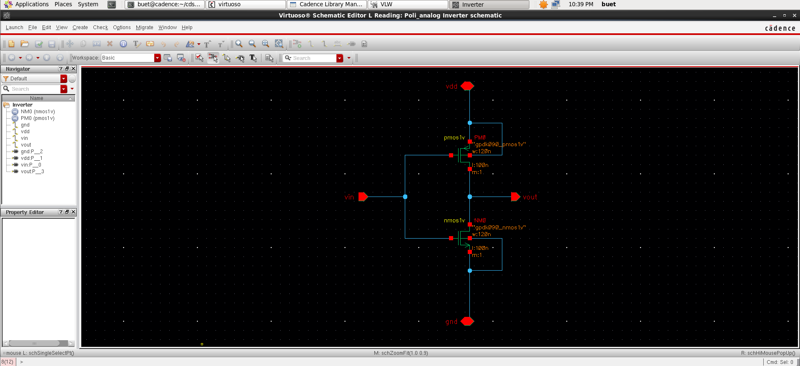
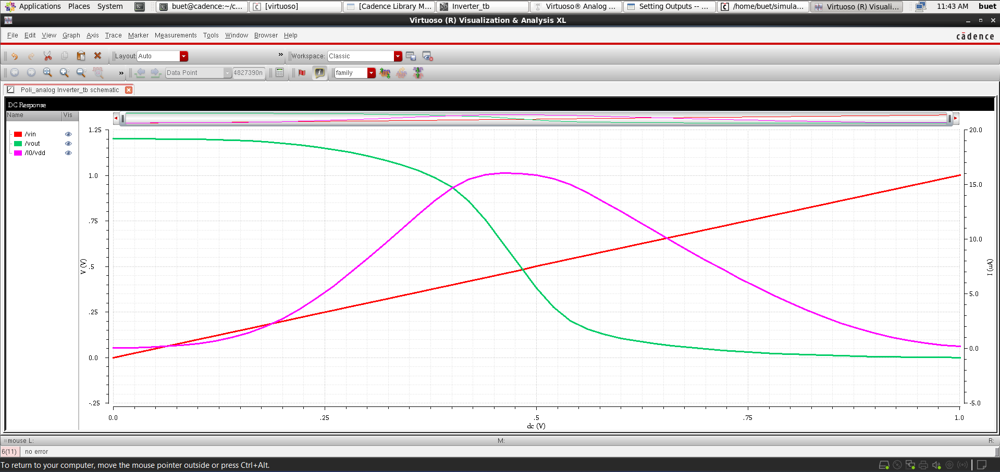
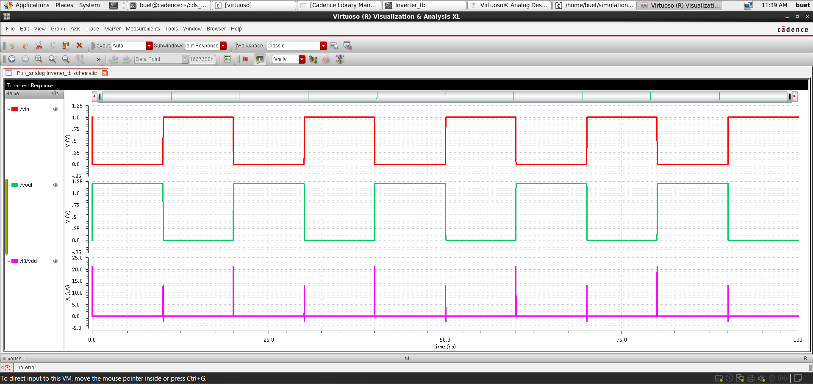
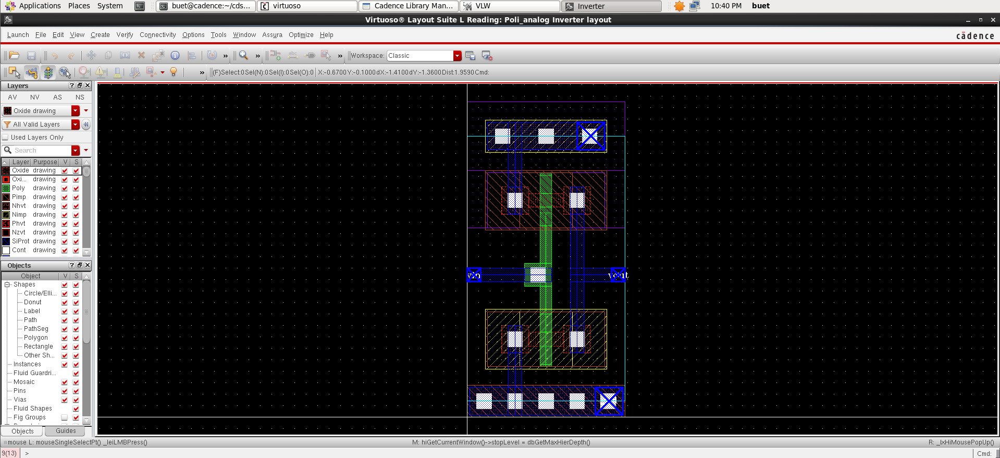
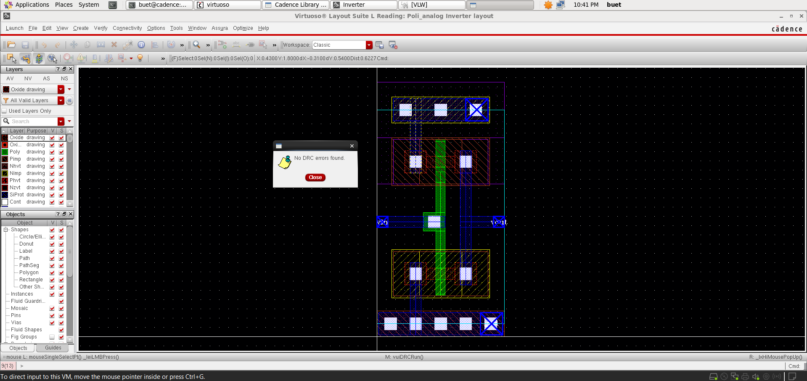
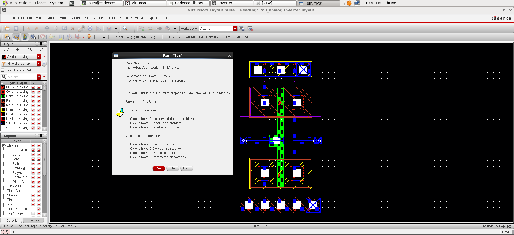
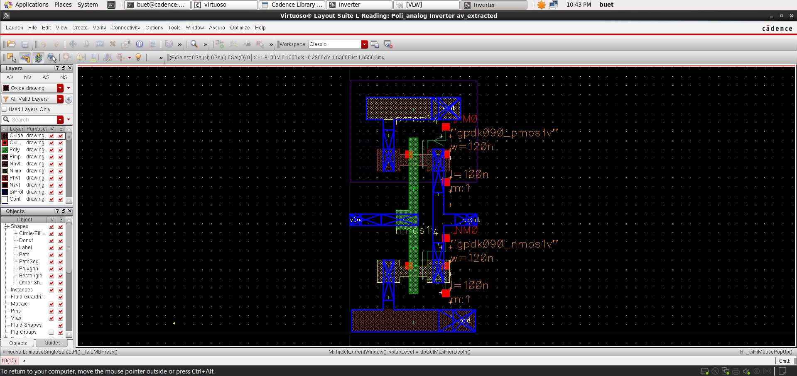
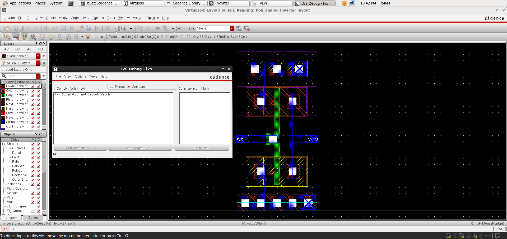

# 📘 CMOS Inverter Design and Analysis (GPDK 90nm)

<p align="center">
  <b>Custom IC Design | Analog Layout | Physical Verification</b><br>
  Cadence Virtuoso • Spectre • Assura • GPDK 90nm
</p>

<p align="center">
  
  
  
  
</p>

---

## 🚀 Overview
This project demonstrates the **complete custom design flow of a CMOS inverter** using **GPDK 90nm technology** in Cadence Virtuoso.

It includes:
- Schematic Design  
- DC & Transient Simulations  
- Parametric Sweep Analysis  
- Layout Design  
- Physical Verification using **Assura (DRC, LVS, RCX)**  

---

## 📂 Project Structure

```
Inverter/
│── README.md        # Project overview and documentation
│── images/          # Simulation results and layout screenshots
│── files/           # Cadence design files (schematic, layout, testbench)
```

---

## 🛠️ Tools & Technology
- **Cadence Virtuoso** (Schematic, ADE, Layout XL)
- **Spectre Simulator**
- **Assura** (DRC, LVS, RCX)
- **PDK:** GPDK 90nm

---

## 📐 Schematic Design

<p align="center">
  
</p>

- CMOS inverter using **PMOS (pull-up)** and **NMOS (pull-down)**
- Input applied to both gates
- Output taken at common drain node

---

## 🔁 DC Analysis (VTC Curve)

<p align="center">
  
  <br><br>
  
</p>

### Observations:
- Clear **Voltage Transfer Characteristics (VTC)**
- Switching threshold shifts with PMOS width (Wp)
- Strong gain region near switching point

---

## ⚡ Transient Analysis

<p align="center">
  
  <br><br>
  
</p>

### Observations:
- Correct logic inversion behavior
- Rise and fall delays observed
- Delay varies with sizing ratio (Wp/Wn)

---

## 📊 Parametric Sweep Analysis

<p align="center">
  
</p>

- Swept **PMOS width (Wp)** from **120nm to 500nm**
- Observed:
  - Switching threshold variation  
  - Delay changes  
  - Output slope differences  

---

## 🧩 Layout Design

<p align="center">
  
</p>

### Features:
- PMOS placed in **N-well**, NMOS in **P-substrate**
- Shared poly gate for input
- Compact and optimized routing
- Proper use of diffusion, poly, metal, and vias

---

## ✅ Verification (Assura)

<p align="center">
  
  
  
</p>

### ✔ DRC (Design Rule Check)
- No violations found  
- Layout follows all GPDK 90nm rules  

### ✔ LVS (Layout vs Schematic)
- Perfect match between schematic and layout  
- No mismatches  

### ✔ RC Extraction (RCX)
- Parasitics extracted successfully  
- Used for post-layout simulation  

---

## 📈 Post-Layout Simulation

<p align="center">
  
  
</p>

- Slight delay increase due to parasitic effects  
- Realistic inverter behavior observed  

---

## 📌 Key Learnings
- Impact of transistor sizing on switching threshold  
- Trade-offs between delay and performance  
- Importance of parasitic extraction  
- Full custom IC design flow experience  

---

## 🎯 Conclusion
Successfully designed, simulated, and verified a CMOS inverter in **GPDK 90nm technology**, covering the complete flow from schematic to post-layout validation using **Cadence Virtuoso and Assura**.

---

## 👨‍💻 Author

**Poli Prudvi Reddy**  
📧 Email: prudvireddypoli@gmail.com  
🔗 LinkedIn: https://www.linkedin.com/in/prudvi-poli  

---

## ⭐ Support
If you found this project useful, give it a ⭐ on GitHub and feel free to connect!
