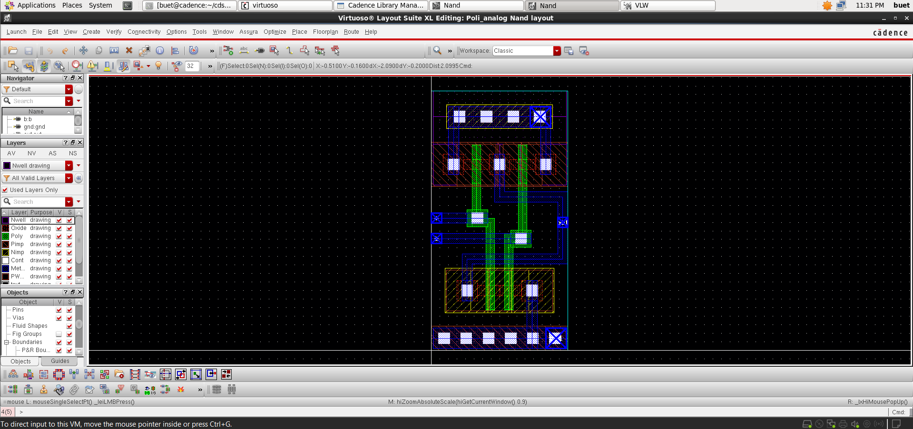
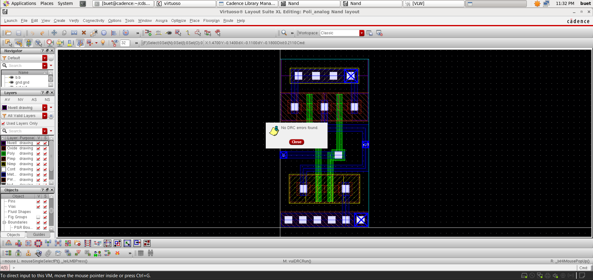
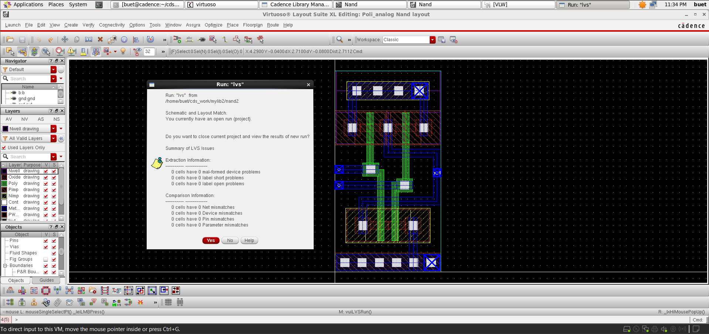
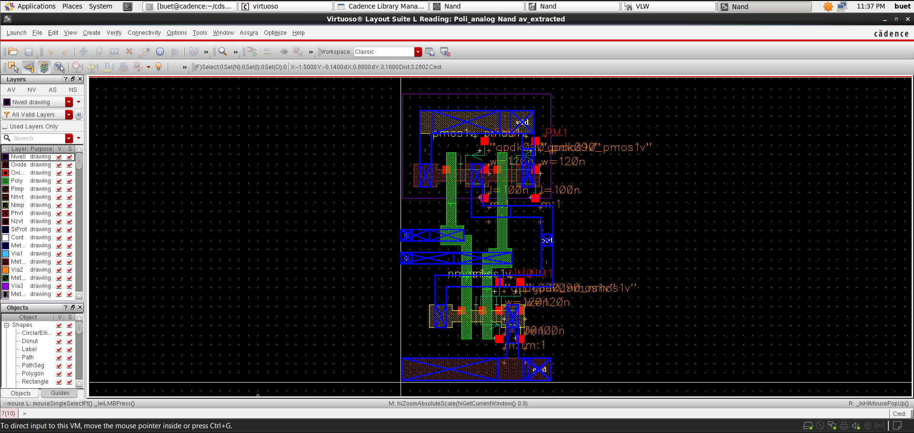
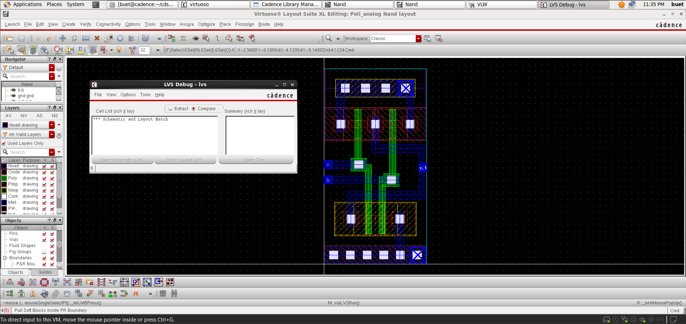
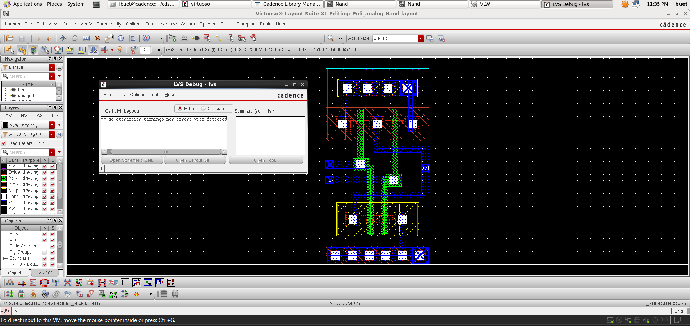

# 📘 CMOS NAND Gate Design and Analysis (GPDK 90nm)

<p align="center">
  <b>Custom IC Design | Digital Logic | Performance Analysis</b><br>
  Cadence Virtuoso • Spectre • Assura • GPDK 90nm
</p>

<p align="center">
  
  
  
  
</p>

---

## 🚀 Overview
This project demonstrates the **design and simulation of a CMOS NAND gate** using **GPDK 90nm technology** in Cadence Virtuoso.

The NAND gate is a **universal logic gate**, forming the foundation for complex digital circuits. This work focuses on **functional verification, delay analysis, and power estimation**.

---

## 📂 Project Structure
```
Nand_Gate/
│── README.md        # Project overview and documentation
│── images/          # Simulation results and layout screenshots
│── files/           # Cadence design files (schematic, layout, testbench)
```


---

## 🛠️ Tools & Technology
- **Cadence Virtuoso** (Schematic, ADE)
- **Spectre Simulator**
- **Assura** (DRC, LVS, RCX)
- **PDK:** GPDK 90nm

---

## 📐 Schematic Design

<p align="center">
  
</p>

- CMOS NAND implementation using:
  - **Parallel PMOS (pull-up network)**
  - **Series NMOS (pull-down network)**
- Output goes LOW only when both inputs are HIGH  

---

## 🔷 Symbol View

<p align="center">
  
</p>

- Custom symbol created for hierarchical design integration  

---

## 🧪 Testbench Setup

<p align="center">
  
</p>

- Two pulse inputs applied to verify all input combinations  
- Output connected with load capacitor  

---

## ⚡ Transient Analysis

<p align="center">
  
</p>

### Observations:
- Correct NAND logic behavior verified  
- Output transitions LOW only when both inputs are HIGH  
- Clean switching with expected delay characteristics  

---

## ⏱️ Delay Analysis

<p align="center">
  
</p>

- Propagation delay measured between input and output  
- **Delay ≈ 5.91 ps**

---

## ⚡ Energy Analysis

<p align="center">
  
</p>

- Switching energy estimated: **~1.711 fJ**  
- Indicates low dynamic power consumption  

---

## 🧩 Layout Design

<p align="center">
  
</p>

### Features:
- PMOS placed in **N-well**, NMOS in **P-substrate**
- Parallel PMOS and series NMOS implementation  
- Shared poly gates for inputs  
- Compact routing with proper contacts and vias  

---

## ✅ Verification (Assura)

<p align="center">
  
  
  
</p>

### ✔ DRC (Design Rule Check)
- No violations found  
- Layout follows all GPDK 90nm rules  

### ✔ LVS (Layout vs Schematic)
- Perfect match between schematic and layout  
- No mismatches  

### ✔ RC Extraction (RCX)
- Parasitics extracted successfully  
- Extracted view generated  

---

## 📈 Post-Layout Simulation

<p align="center">
  
  
</p>

- Extracted view generated after RCX  
- Ready for post-layout simulation   

---

## 📌 Key Learnings
- CMOS NAND gate design using pull-up and pull-down networks  
- Timing analysis and delay estimation  
- Power estimation using Cadence ADE  
- Understanding switching behavior in digital circuits  

---

## 🎯 Conclusion
The CMOS NAND gate has been successfully designed and verified through simulation.  
Further work includes **layout design and physical verification** to complete the full custom IC design flow.

---

## 👨‍💻 Author

**Poli Prudvi Reddy**  
📧 Email: prudvireddypoli@gmail.com  
🔗 LinkedIn: https://www.linkedin.com/in/prudvi-poli  

---

## ⭐ Support
If you found this project useful, give it a ⭐ on GitHub and feel free to connect!
