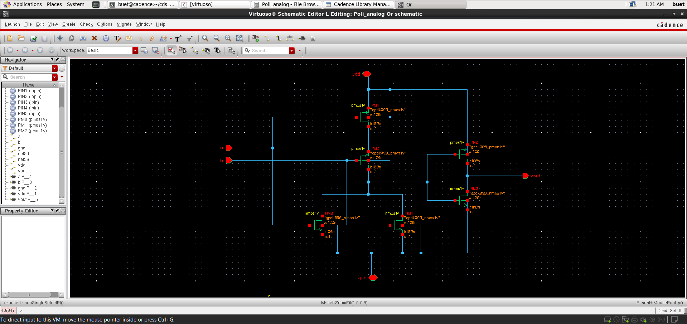
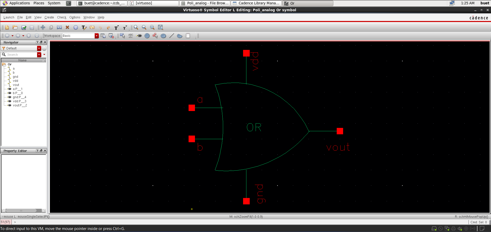
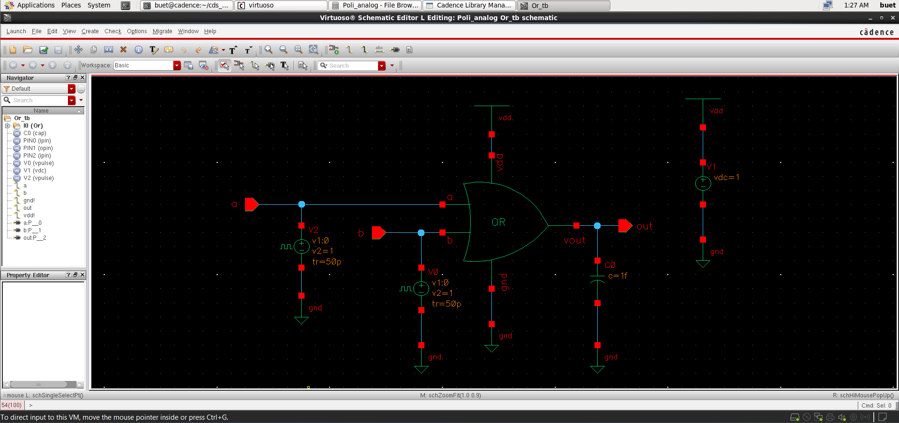
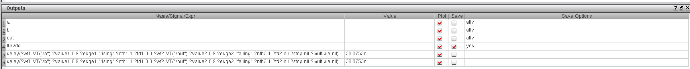
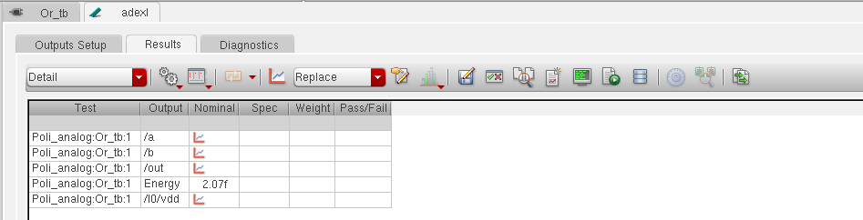

# 📘 CMOS OR Gate Design and Analysis (GPDK 90nm)

<p align="center">
  <b>Custom IC Design | Digital Logic | Performance Analysis</b><br>
  Cadence Virtuoso • Spectre • Assura • GPDK 90nm
</p>

<p align="center">
  
  
  
  
</p>

---

## 🚀 Overview
This project presents the **design and simulation of a CMOS OR gate** using **GPDK 90nm technology** in Cadence Virtuoso.

The OR gate is implemented using **CMOS logic derived from NOR + inverter configuration**, ensuring proper logic functionality and signal restoration.

---

## 📂 Project Structure
```
Inverter/
│── README.md        # Project overview and documentation
│── images/          # Simulation results and layout screenshots
│── files/           # Cadence design files (schematic, layout, testbench)
```

---

## 🛠️ Tools & Technology
- **Cadence Virtuoso**
- **Spectre Simulator**
- **Assura (DRC, LVS, RCX)**
- **PDK:** GPDK 90nm

---

## 📐 Schematic Design

<p align="center">
  
</p>

- CMOS OR implementation using:
  - **NOR gate + CMOS inverter**
- Ensures:
  - Full voltage swing  
  - Improved signal integrity  

---

## 🔷 Symbol View

<p align="center">
  
</p>

- Custom hierarchical symbol created  

---

## 🧪 Testbench Setup

<p align="center">
  
</p>

- Two pulse inputs applied  
- Covers all logic combinations  
- Output connected to load capacitor  

---

## ⚡ Transient Analysis

<p align="center">
  
</p>

### Observations:
- Correct OR functionality verified  
- Output HIGH when any input is HIGH  
- Stable switching transitions observed  

---

## ⏱️ Delay Analysis

<p align="center">
  
</p>

- Propagation delay measured  
- **Delay ≈ 30 ns**

---

## ⚡ Energy Analysis

<p align="center">
  
</p>

- Energy consumption during switching  
- **Energy ≈ 2.07 fJ**

---

## 🧩 Layout Design *(In Progress 🚧)*
- Layout implementation using GPDK 90nm  
- Focus on:
  - Parasitic-aware design  
  - Area optimization  
  - Routing efficiency  

---

## ✅ Verification (Assura)

### ✔ DRC (Design Rule Check)
- Layout rule compliance verification *(upcoming)*  

### ✔ LVS (Layout vs Schematic)
- Functional equivalence check *(upcoming)*  

### ✔ RC Extraction (RCX)
- Parasitic extraction for post-layout simulation *(upcoming)*  

---

## 📈 Post-Layout Analysis *(Upcoming 🚧)*
- Performance comparison (pre vs post layout)  
- Delay and power variation analysis  

---

## 📌 Key Learnings
- CMOS OR implementation using logic transformation  
- Importance of inverter buffering  
- Delay and energy trade-offs  
- Digital switching behavior in CMOS  

---

## 🎯 Conclusion
The CMOS OR gate has been successfully designed and verified through simulation.  
Future work includes **layout design and physical verification** to complete the full IC design flow.

---

## 👨‍💻 Author

**Poli Prudvi Reddy**  
📧 Email: prudvireddypoli@gmail.com  
🔗 LinkedIn: https://www.linkedin.com/in/prudvi-poli  

---

## ⭐ Support
If you found this project useful, give it a ⭐ on GitHub!
