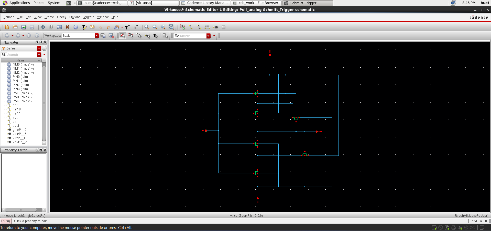
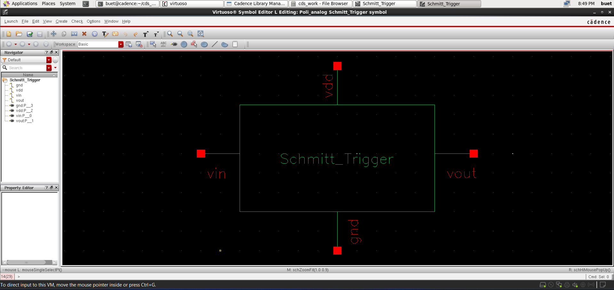
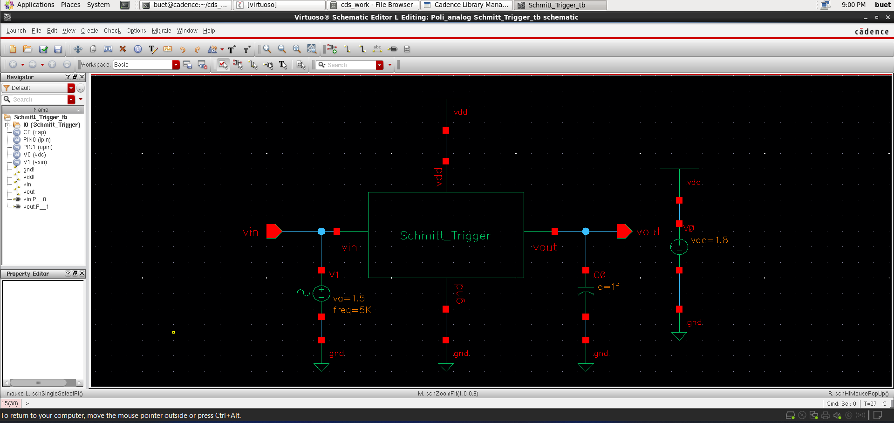
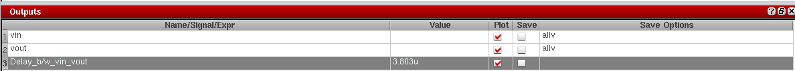
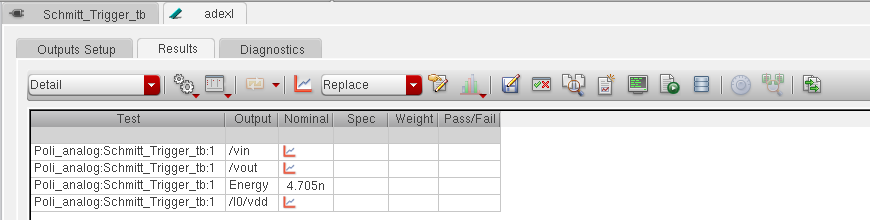

# 📘 CMOS Schmitt Trigger Design and Analysis (GPDK 90nm)

<p align="center">
  <b>Custom IC Design | Analog Behavior | Hysteresis Analysis</b><br>
  Cadence Virtuoso • Spectre • GPDK 90nm
</p>

<p align="center">
  
  
  
  
</p>

---

## 🚀 Overview
This project demonstrates the **design and simulation of a CMOS Schmitt Trigger** using **GPDK 90nm technology** in Cadence Virtuoso.

The Schmitt Trigger introduces **hysteresis behavior** using positive feedback, improving **noise immunity** and ensuring stable switching for noisy or slow input signals.

---

## 📂 Project Structure
```
Schmitt_Trigger/
│── README.md        # Project overview and documentation
│── images/          # Simulation results and layout screenshots
│── files/           # Cadence design files (schematic, layout, testbench)
```


---

## 🛠️ Tools & Technology
- **Cadence Virtuoso** (Schematic, ADE)
- **Spectre Simulator**
- **PDK:** GPDK 90nm

---

## 📐 Schematic Design

<p align="center">
  
</p>

- CMOS implementation with **positive feedback**
- Generates **two switching thresholds (hysteresis)**
- Improves noise immunity over conventional inverter

---

## 🔷 Symbol View

<p align="center">
  
</p>

- Custom symbol designed for hierarchical usage

---

## 🧪 Testbench Setup

<p align="center">
  
</p>

- Sinusoidal input applied to observe switching thresholds  
- Output connected with load capacitor  

---

## ⚙️ Working Principle & Circuit Analysis

A CMOS Schmitt Trigger uses **positive feedback** to introduce hysteresis, resulting in two distinct switching thresholds:

- **Upper Threshold (VTH+)**
- **Lower Threshold (VTH−)**

This ensures stable switching even in the presence of noise.

---

### 🔍 Circuit Operation

#### 🟢 Input Rising (0 → VDD)
- Output initially **HIGH**
- Feedback network raises switching threshold
- Output switches LOW when:
  **Vin > VTH+**

---

#### 🔴 Input Falling (VDD → 0)
- Output initially **LOW**
- Feedback network lowers switching threshold
- Output switches HIGH when:
  **Vin < VTH−**

---

### 🔁 Hysteresis Behavior

Hysteresis width:

```
VH = VTH+ - VTH−
```

**Benefits:**
- Eliminates noise-induced switching  
- Stabilizes slow input signals  
- Improves digital signal reliability  

---

### ⚡ Key Insight

| Circuit Type     | Threshold | Noise Immunity |
|-----------------|----------|---------------|
| CMOS Inverter   | Single   | Low           |
| Schmitt Trigger | Dual     | High          |

---

### 🎯 Applications
- Signal conditioning  
- Oscillators  
- ADC input stages  
- Switch debouncing  

---

## ⚡ Transient Analysis

<p align="center">
  
</p>

### Observations:
- Converts noisy analog input into clean digital output  
- Exhibits clear hysteresis behavior  
- Stable transitions with reduced noise sensitivity  

---

## ⏱️ Delay Analysis

<p align="center">
  
</p>

- Propagation delay measured between input and output  
- **Delay ≈ 3.8 µs**

---

## ⚡ Energy Analysis

<p align="center">
  
</p>

- Switching energy estimated: **~4.705 nJ**  
- Reflects dynamic power during transitions  

---

## ✅ Simulation Verification

- Functional verification using transient analysis  
- Hysteresis behavior validated through input-output response  
- Delay and energy metrics extracted using Cadence ADE  

---

## 📈 Future Scope
- Perform layout implementation and post-layout simulation  
- Analyze parasitic impact on hysteresis and delay  
- Optimize transistor sizing for improved performance  

---

## 📌 Key Learnings
- Hysteresis implementation using positive feedback  
- Noise immunity improvement in CMOS circuits  
- Delay and energy analysis using Cadence ADE  
- Analog-to-digital signal conditioning behavior  

---

## 🎯 Conclusion
The CMOS Schmitt Trigger has been successfully designed and analyzed through simulation.  
The circuit demonstrates strong **hysteresis behavior**, improved **noise immunity**, and reliable switching performance.

---

## 👨‍💻 Author

**Poli Prudvi Reddy**  
📧 Email: prudvireddypoli@gmail.com  
🔗 LinkedIn: https://www.linkedin.com/in/prudvi-poli  

---

## ⭐ Support
If you found this project useful, give it a ⭐ on GitHub and feel free to connect!
