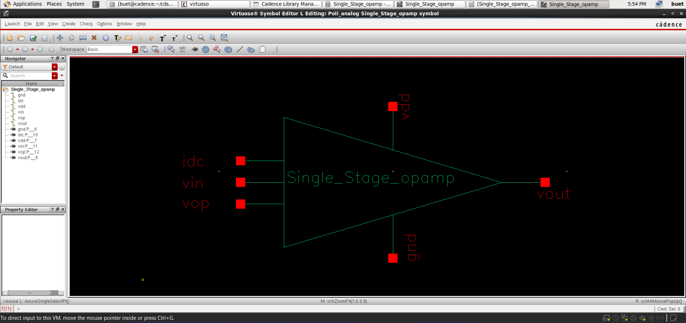
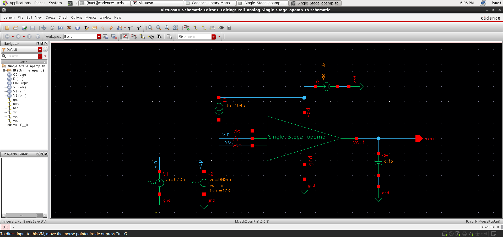
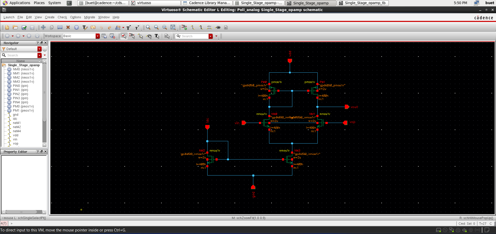
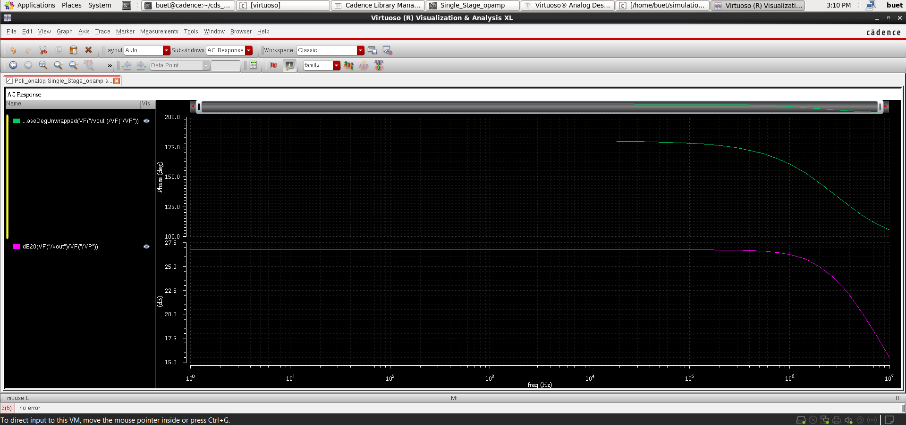
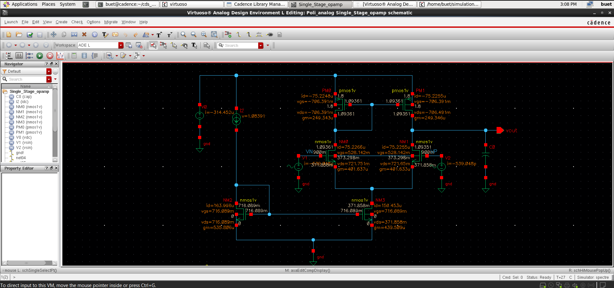

# 📘 Single-Stage CMOS Operational Amplifier (GPDK 90nm)

<p align="center">
  <b>Analog IC Design | Differential Amplifier | Gain Stage</b>
</p>

<p align="center">
  
  
  
</p>

<p align="center">
  
  
  
</p>

<p align="center">
  
  
</p>

---

## 🚀 Overview

This project presents the design and simulation of a **Single-Stage CMOS Operational Amplifier** using Cadence Virtuoso.

The circuit is based on a **differential input stage with current mirror load**, converting differential input signals into a **single-ended amplified output**.

---

## 📂 Project Structure

```
Single_Stage_Opamp/
│── README.md
│── images/
│── files/
```

---

## 🔷 Symbol Representation

<p align="center">
  
</p>

---

## 🧪 Testbench Setup

<p align="center">
  
</p>

---

## 📐 Schematic Design

<p align="center">
  
</p>

---

## ⚙️ Working Principle

The op-amp operates using a **differential pair with active load**.

### 🔹 Key Operation

- NMOS transistors form the **input differential pair**
- A constant **tail current source** biases the circuit  
- PMOS transistors act as **current mirror load**

### 🔹 Behavior

- When **VIN+ > VIN−** → Output decreases  
- When **VIN− > VIN+** → Output increases  
- Converts differential signal to **single-ended output**  
- Provides voltage amplification with inversion  

---

## ⚙️ Simulation Setup

<p align="center">
  
</p>

---

## 📈 AC Analysis

<p align="center">
  
</p>

### 🔹 Observations

- High gain at low frequencies  
- Gain decreases at higher frequencies  
- Bandwidth limitation observed  
- Phase shift increases with frequency  

---

## ⚡ Transient Analysis

<p align="center">
  
</p>

### 🔹 Observations

- Output is amplified version of input  
- Inversion behavior clearly observed  
- Stable waveform with proper biasing  

---

## 🔍 DC Analysis

<p align="center">
  
</p>

### 🔹 Observations

- Proper biasing ensures all MOSFETs operate in saturation  
- Stable operating point achieved  
- Output varies linearly for small input differences  
- Confirms correct amplifier functionality    

---

## 🧩 Layout Design (In Progress 🚧)

Layout implementation using **GPDK 90nm rules**

Focus on:
- Proper matching of differential pair  
- Symmetrical layout for accuracy  
- Careful routing to reduce noise  
- Minimizing parasitic effects  

---

## ✅ Verification (Assura)

✔ DRC (Design Rule Check)  
- Layout design is currently under implementation  
- Will ensure compliance with GPDK 90nm rules  

✔ LVS (Layout vs Schematic)  
- Will verify equivalence between schematic and layout  
- Ensures correct connectivity and functionality  

✔ RC Extraction (RCX)  
- Parasitic extraction planned after layout completion  
- Enables accurate post-layout simulation  

---

## 📈 Post-Layout Analysis (Upcoming 🚧)

- Compare pre-layout vs post-layout performance  
- Analyze gain reduction due to parasitics  
- Study bandwidth variation  
- Evaluate circuit stability  

---

## 📊 Key Insights

- Differential pair is core of analog amplification  
- Current mirror improves gain  
- Biasing controls performance  
- Frequency response defines bandwidth  

---

## 📌 Key Learnings

- Differential amplifier design  
- Current mirror implementation  
- Analog biasing techniques  
- Gain vs bandwidth trade-off  
- AC and transient analysis  

---

## 🎯 Conclusion

The designed single-stage op-amp demonstrates:

- Stable DC operation  
- Effective signal amplification  
- Proper frequency response behavior  
- Reliable transient performance  

This project forms the foundation for **multi-stage op-amps and advanced analog IC design**.

---

## 👨‍💻 Author

**Poli Prudvi Reddy**  
📧 prudvireddypoli@gmail.com  
🔗 https://www.linkedin.com/in/prudvi-poli  

---

## ⭐ Support

If you found this project useful, consider giving it a ⭐
