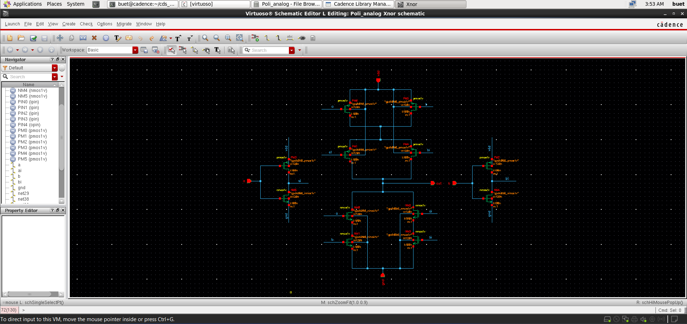
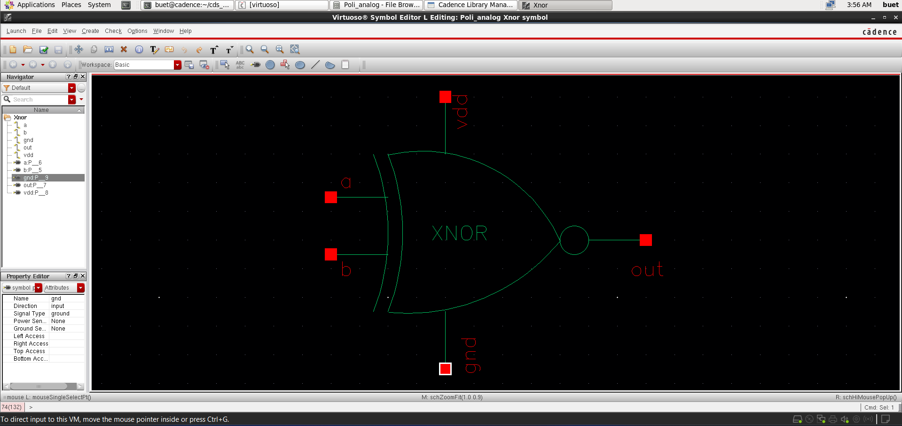
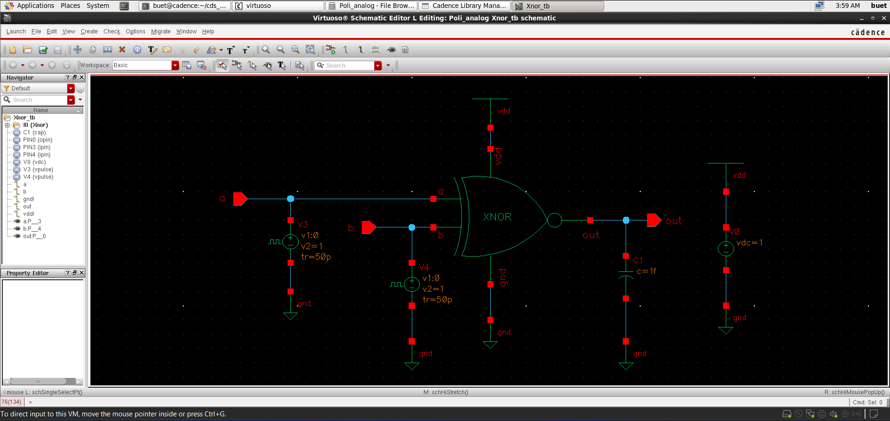
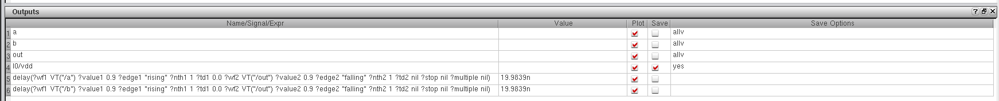
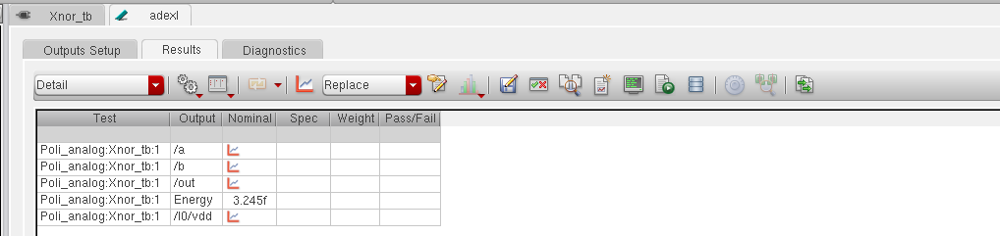

# 📘 CMOS XNOR Gate Design and Analysis (GPDK 90nm)

<p align="center">
  <b>Custom IC Design | Complex Digital Logic | Performance Optimization</b><br>
  Cadence Virtuoso • Spectre • Assura • GPDK 90nm
</p>

<p align="center">
  
  
  
  
</p>

---

## 🚀 Overview
This project presents the **design and simulation of a CMOS XNOR (Exclusive-NOR) gate** using **GPDK 90nm technology** in Cadence Virtuoso.

The XNOR gate is a **complex combinational logic circuit**, often implemented using XOR followed by inversion or optimized transistor-level logic to ensure full swing and improved performance.

---

## 📂 Project Structure
```
Xnor_Gate/
│── README.md        # Project overview and documentation
│── images/          # Simulation results and layout screenshots
│── files/           # Cadence design files (schematic, layout, testbench)
```

---

## 🛠️ Tools & Technology
- **Cadence Virtuoso**
- **Spectre Simulator**
- **Assura (DRC, LVS, RCX)**
- **PDK:** GPDK 90nm

---

## 📐 Schematic Design

<p align="center">
  
</p>

- CMOS implementation using:
  - Complementary pull-up and pull-down networks  
  - Internal inversion paths for correct logic realization  
- Function:
  - \( Y = \overline{A \oplus B} \)

---

## 🔷 Symbol View

<p align="center">
  
</p>

- Custom XNOR symbol created for hierarchical design  

---

## 🧪 Testbench Setup

<p align="center">
  
</p>

- Pulse inputs applied to both inputs  
- Covers all logic combinations  
- Output connected to capacitive load  

---

## ⚡ Transient Analysis

<p align="center">
  
</p>

### Observations:
- Correct XNOR functionality verified:
  - Output HIGH when inputs are same  
  - Output LOW when inputs differ  
- Clean transitions with minor switching glitches  

---

## ⏱️ Delay Analysis

<p align="center">
  
</p>

- Propagation delay measured  
- **Delay ≈ 19.98 ns**

---

## ⚡ Energy Analysis

<p align="center">
  
</p>

- Energy consumption during switching  
- **Energy ≈ 3.25 fJ**

---

## 🧩 Layout Design *(In Progress 🚧)*
- Layout development using GPDK 90nm  
- Key challenges:
  - Higher transistor count  
  - Routing complexity  
  - Maintaining symmetry  
  - Minimizing parasitics  

---

## ✅ Verification (Assura)

### ✔ DRC (Design Rule Check)
- Ensures layout rule compliance *(upcoming)*  

### ✔ LVS (Layout vs Schematic)
- Confirms functional equivalence *(upcoming)*  

### ✔ RC Extraction (RCX)
- Includes parasitic effects for accurate timing *(upcoming)*  

---

## 📈 Post-Layout Analysis *(Upcoming 🚧)*
- Delay and power comparison  
- Parasitic impact evaluation  

---

## 📌 Key Learnings
- Implementation of complex CMOS logic gates  
- Trade-offs between:
  - Power  
  - Delay  
  - Area  
- Importance of signal restoration and complementary paths  
- Impact of additional inversion stages on performance  

---

## 🎯 Conclusion
The CMOS XNOR gate has been successfully designed and verified through simulations.  
Due to its complexity, the XNOR gate exhibits **higher power consumption and delay compared to basic logic gates**, making it an essential design for understanding advanced CMOS logic optimization.

Future work includes completing **layout and post-layout verification**.

---

## 👨‍💻 Author

**Poli Prudvi Reddy**  
📧 Email: prudvireddypoli@gmail.com  
🔗 LinkedIn: https://www.linkedin.com/in/prudvi-poli  

---

## ⭐ Support
If you found this project useful, give it a ⭐ on GitHub!
