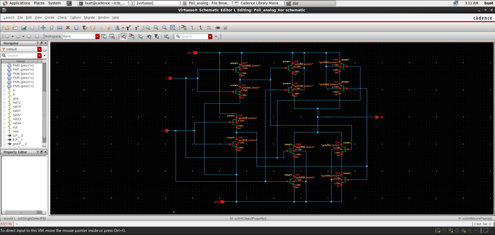
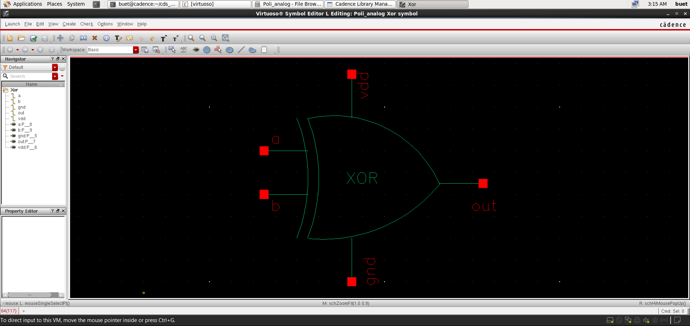
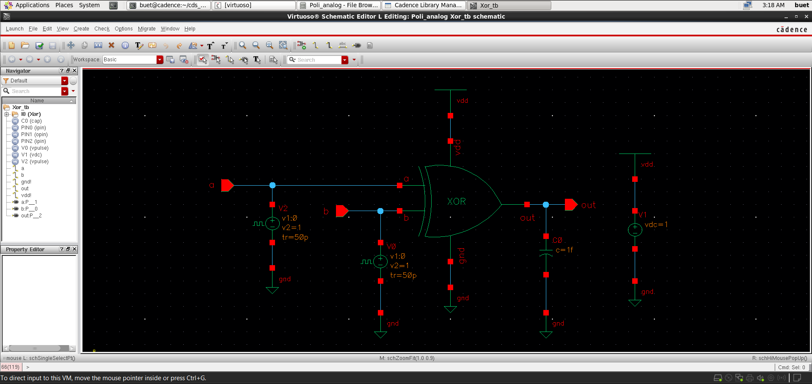
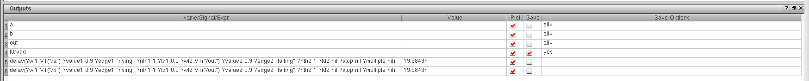
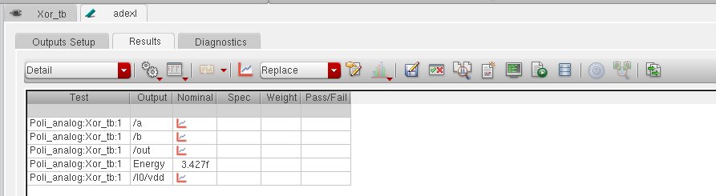

# 📘 CMOS XOR Gate Design and Analysis (GPDK 90nm)

<p align="center">
  <b>Custom IC Design | Complex Digital Logic | Performance Analysis</b><br>
  Cadence Virtuoso • Spectre • Assura • GPDK 90nm
</p>

<p align="center">
  
  
  
  
</p>

---

## 🚀 Overview
This project presents the **design and simulation of a CMOS XOR (Exclusive-OR) gate** using **GPDK 90nm technology** in Cadence Virtuoso.

The XOR gate is a **complex combinational logic circuit**, implemented using multiple transistor networks to achieve correct switching behavior and full voltage swing.

---

## 📂 Project Structure
```
Xor_Gate/
│── README.md        # Project overview and documentation
│── images/          # Simulation results and layout screenshots
│── files/           # Cadence design files (schematic, layout, testbench)
```

---

## 🛠️ Tools & Technology
- **Cadence Virtuoso**
- **Spectre Simulator**
- **Assura (DRC, LVS, RCX)**
- **PDK:** GPDK 90nm

---

## 📐 Schematic Design

<p align="center">
  
</p>

- CMOS implementation using:
  - Complementary pull-up and pull-down networks  
  - Multiple transistor paths for conditional switching  
- Designed to realize:
  - \( Y = A \oplus B \)

---

## 🔷 Symbol View

<p align="center">
  
</p>

- Custom hierarchical XOR symbol created  

---

## 🧪 Testbench Setup

<p align="center">
  
</p>

- Two pulse inputs applied  
- Covers all input combinations  
- Output connected to load capacitor  

---

## ⚡ Transient Analysis

<p align="center">
  
</p>

### Observations:
- XOR behavior verified:
  - Output HIGH when inputs are different  
  - Output LOW when inputs are same  
- Clean switching transitions observed  

---

## ⏱️ Delay Analysis

<p align="center">
  
</p>

- Propagation delay measured  
- **Delay ≈ 19.98 ns**

---

## ⚡ Energy Analysis

<p align="center">
  
</p>

- Energy consumption during switching  
- **Energy ≈ 3.42 fJ**

---

## 🧩 Layout Design *(In Progress 🚧)*
- Layout implementation using GPDK 90nm  
- Focus areas:
  - Complex routing due to higher transistor count  
  - Matching and symmetry  
  - Parasitic minimization  

---

## ✅ Verification (Assura)

### ✔ DRC (Design Rule Check)
- Layout rule compliance verification *(upcoming)*  

### ✔ LVS (Layout vs Schematic)
- Functional equivalence validation *(upcoming)*  

### ✔ RC Extraction (RCX)
- Parasitic extraction for accurate timing analysis *(upcoming)*  

---

## 📈 Post-Layout Analysis *(Upcoming 🚧)*
- Delay and power comparison (pre vs post layout)  
- Impact of parasitics on XOR performance  

---

## 📌 Key Learnings
- Design of complex CMOS logic gates  
- Trade-offs between:
  - Speed  
  - Power  
  - Transistor count  
- Importance of signal restoration in XOR design  
- Increased delay due to logic complexity  

---

## 🎯 Conclusion
The CMOS XOR gate has been successfully designed and verified through simulations.  
Due to its complexity, the XOR gate demonstrates **higher delay and power compared to basic gates**, making it an important study in performance optimization.

Future work includes **layout design and physical verification** to complete the full custom IC design flow.

---

## 👨‍💻 Author

**Poli Prudvi Reddy**  
📧 Email: prudvireddypoli@gmail.com  
🔗 LinkedIn: https://www.linkedin.com/in/prudvi-poli  

---

## ⭐ Support
If you found this project useful, give it a ⭐ on GitHub!
